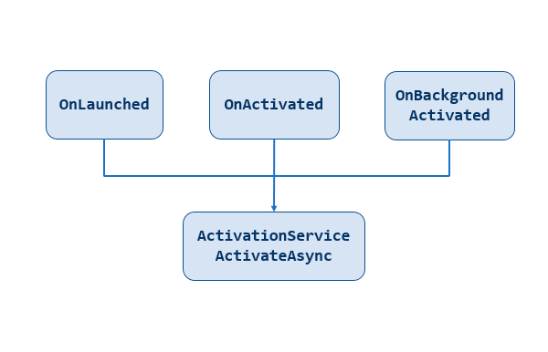
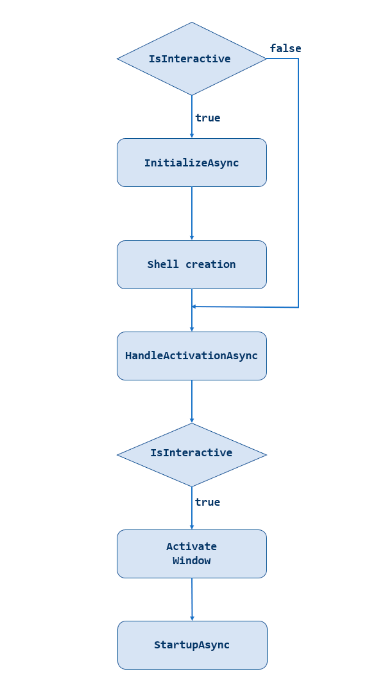

# ActivationService & ActivationHandlers

:heavy_exclamation_mark: There is also a version of [this document with code samples in VB.Net](./activation.vb.md) :heavy_exclamation_mark: |
-------------------------------------------------------------------------------------------------------------------------------------------- |

## ActivationService

The ActivationService is in charge of handling the applications initialization and activation.

With the method `ActivateAsync()` it has one common entry point that is called from the app lifecycle events `OnLaunched`, `OnActivated` and `OnBackgroundActivated`.
For more information on application lifecycle and its events see [Windows 10 universal Windows platform (UWP) app lifecycle](https://docs.microsoft.com/en-us/windows/uwp/launch-resume/app-lifecycle).

## ActivationHandlers

For choosing the concrete type of activation the ActivationService relies on ActivationHandlers, that are registered in the method `GetActivationHandlers()`.

Each class in the application that can handle application activation should derive from the abstract class `ActivationHandler<T>` (T is the type of ActivationEventArguments the class can handle) and implement the method HandleInternalAsync().
The method `HandleInternalAsync()` is where the actual activation takes place.
The virtual method `CanHandleInternal()` checks if the incoming activation arguments are of the type the ActivationHandler can manage. It can be overwritten to establish further conditions based on the ActivationEventArguments.

### ActivationHandlers sample

We'll have look at the SchemeActivationHandler, added by DeepLink feature, to see how activation works in detail:

```csharp
protected override bool CanHandleInternal(ProtocolActivatedEventArgs args)
{
    // If your app has multiple handlers of ProtocolActivationEventArgs
    // use this method to determine which to use. (possibly checking args.Uri.Scheme)
    return true;
}

// By default, this handler expects URIs of the format 'wtsapp:sample?paramName1=paramValue1&paramName2=paramValue2'
protected override async Task HandleInternalAsync(ProtocolActivatedEventArgs args)
{
    // Create data from activation Uri in ProtocolActivatedEventArgs
    var data = new SchemeActivationData(args.Uri);
    if (data.IsValid)
    {
        NavigationService.Navigate(data.PageType, data.Parameters);
    }

    await Task.CompletedTask;
}
```

The `CanHandleInternal()` method was overwritten here and it returns true by default, devs could use args to add extra validations in scenarios with multiple ProtocolActivationEventArgs.

The `HandleInternalAsync()` method gets the ActivationData from argument's Uri and uses the PageType and Parameters to navigate.

## Activation in depth

### Activation flow

The following flowchart shows the Activation proccess that starts with an app lifecycle event and ends with StartupAsync method call.

**ActivateAsync**

Activation starts from an app lifecycle event: `OnLaunched`, `OnActivated` or `OnBackgroundActivated`.



The flowchart shows that the first in ActivateAsync is to call InitializeAsync and do the ShellCreation, both actions are excluded from background running (IsInteractive check). If you have added an Identity feature to your app, this block also will include code for Identity configuration and SilentLogin.

After this first block, the flowchart calls to HandleActivation (explained below).



**IsInteractive**

All interactions with the app window and navigations are only available when the activation arguments extend from IActivatedEventArgs, this allows ActivationService runs activation code on running background task without activating the window.

**InitializeAsync**

InitializeAsync contains static or singleton services initialization for services that are going to be used as ActivationHandler. This method is called before the window is activated. The code in this method runs while the splash screen is shown, initializations from classes different from ActivationHandlers should be placed at StartupAsync method.

**StartupAsync**

StartupAsync contains initializations of some classes and start's processes that will be run after the Window is activated.

## Sample: Add activation from File Association

Let's add activation from a file association:
We created a sample application, that allows to view markdown (.md) files. You can check the sample here: [Markdown Viewer](/samples/activation).

The sample application was created using Windows Template Studio with the following configuration:

* Project Type: Blank
* Framework: MVVM Basic
* Pages: MainPage and MarkdownPage

For viewing the markdown a MarkdownTextBlock from the [Windows Community Toolkit](https://github.com/Microsoft/WindowsCommunityToolkit) was added.

### Set up File Association Activation

First we have to add a file type association declaration in the application manifest, allowing the App to be shown as a default handler for markdown files.

 

Further we have to handle the file activation event by implementing OnFileActivated:

```csharp
protected override async void OnFileActivated(FileActivatedEventArgs args)
{
    await ActivationService.ActivateAsync(args);
}
```

### Add a FileAssociationService

Then we need a service that handles this new type of activation. We'll call it FileAssociationService, it derives from `ApplicationHandler<T>`. 
As it manages activation by File​Activated​Event​Args the signature would be: 

```csharp
internal class FileAssociationService : ActivationHandler<File​Activated​Event​Args>
{

}
```

Next, we'll implement HandleInternalAsync(), to evaluate the event args, and take action:

```csharp
protected override async Task HandleInternalAsync(File​Activated​Event​Args args)
{
    var file = args.Files.FirstOrDefault();

    NavigationService.Navigate(typeof(MarkdownPage), file);

    await Task.CompletedTask;
}
```

### Add the FileAssociationService to ActivationService

Last but not least, we'll have to add our new FileAssociationService to the ActivationHandlers registered in the ActivationService:

```csharp
private IEnumerable<ActivationHandler> GetActivationHandlers()
{
    yield return Singleton<FileAssociationService>.Instance;
    yield break;
}
```
