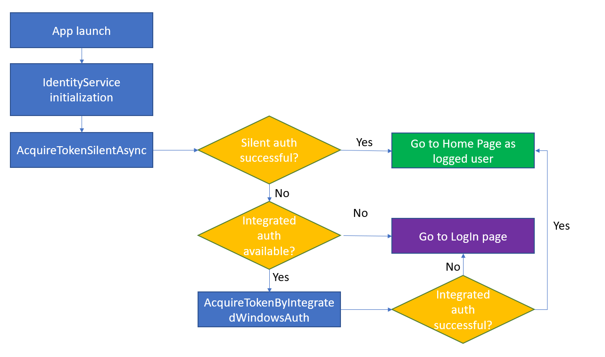
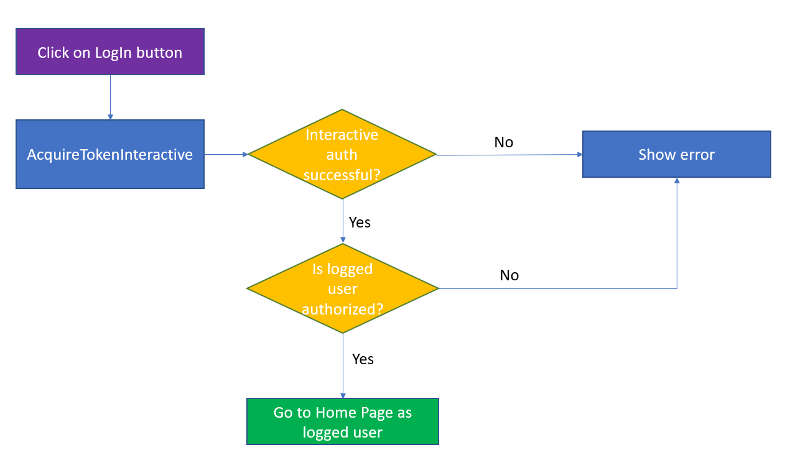

# Identity
**Table of Contents**
* [Introduction](#introduction)
* [Authentication Endpoints](#authentication-endpoints)
* [Understanding the authentication flow](#understanding-the-authentication-flow)
    * [Forced Login authentication flow](#forced-login-authentication-flow)
    * [Optional Login authentication flow](#optional-login-authentication-flow)
* [Understanding the code](#understanding-the-code)
    * [Common code](#common-code)
    * [Forced Login code](#forced-login-code)
    * [Optional Login code](#optional-login-code)
* [Calling the Microsoft.Graph](#calling-the-microsoft.graph)
* [Terminology](#terminology)

## Introduction

Identity group features add to your app the ability to request user authentication to restrict the use of the app (Forced Login) or enable restricted content (Optional Login). Both features will use the Microsoft Authentication Library (MSAL) Nuget Package to authenticate the user with Azure Active Directory. Once the user has been authenticated, the app will call to Microsoft Graph API to retrieve user information. The app will contain a settings page added as dependency with a user section to log out.

## Authentication Endpoints

You can choose different ways to initialize the IdentityService, with that, we will choose de account types that can be authenticated with the application.

1. AAD and personal Microsoft accounts **(Default)**
2. AAD multiple organizations
3. AAD single orgganization

Options 2 and 3 also includes the possibility to use Windows Integrated Auth.

## Understanding the authentication flow

Authentication process will be added on app initialization in ActivationService (App.xaml.cs in Prism).
The LogIn process will obtain an access token to get a user single identification, this access token will be used as an authentication parameter in restricted access APIs like Microsoft Graph API.

Once authentication succeeds, IdentityService also adds a method to include an extra authentication validation (i.e. database verification) to specify is a user is authorized.

Both features use silent login and interactive login. The silent login at app launch moment and the interactive login with a new window prompt when the users click on log in, the differences between forced and optional are in pages navigation order and the content that user can view without do the login.

Here are graphics that explain the login processes.

**Silent LogIn**



**Interactive LogIn**



### Forced Login authentication flow

Forced Login starts in a landing login page if the user is not logged in and restricts the access to the rest of the pages if the user is not authenticated and authorized.

### Optional Login authentication flow

Optional Login does not change the pages launch order but adds a log in and log out buttons in the Settings page. NavigationView and TabbedNav project types also add a user button in the SellPage.

You can also specify a Restricted attribute in all pages that you want to be restricted of authenticated and authorized users.

## Understanding the code

### Common code

#### IdentityService (Core project)

This class is responsible to request the user credentials and use that to obtain the access token for this user. The class uses the MSAL Nuget library to connect with AAD services. The generated apps include a ClientID for testing purposes that it must be replaced by a new one before going to production.

#### MicrosoftGraphService (Core project)

This class calls to Microsoft Graph with a HttpClient passing the user access token as a parameter to obtain the user information and the user photo. This class could be extended adding methods that get info from different Microsoft Graph services.

#### UserActivityService

This class consumes MicrosoftGraphService and is responsible to store the user info in cache.

#### Dependencies

 - Settings Page that includes the user section and log in and log out buttons.

#### Licenses

 - [MSAL: Microsoft authentication library](https://github.com/AzureAD/microsoft-authentication-library-for-dotnet)
 - [ConfigurationManager](https://github.com/dotnet/corefx/blob/master/LICENSE.TXT)

### Forced Login code

Forced login adds a login page with a button that calls to IdentityService. When the user is logged in, the apps restore the Shell page with no possibilities to come back to the Login page.

If the app is launch from activation like ToastNotification or DeepLinking and the user is not logged in, the app resumes the activation flow after the user completes the login process.

### Optional Login code

Optional login handles two properties to identify different users and allow content for each user, IsAuthenticated and IsAuthorized. With that scenario, all user that do log in with AAD is authenticated in the app and can see the user section and the logout button, but only if this user is authorized, can see the restricted content. Authorization method returns true by default but you can add logic in that method, like validation in a database.
Yo have to add some code to limit the content that not logged in users can see. There is the code you have to add to restrict a page for logged in users.

PageName.xaml.cs

```csharp
namespace YourAppNamespace.Views
{
    [Restricted]
    public sealed partial class PageName : Page
    {
        public PageName()
        {
        }
    }
}
```

ShellPage.xaml

```xml
<!--
Find MenuItems definition in page xaml code
-->
<winui:NavigationView.MenuItems>
    <!--
    Add helpers:NavHelper.NavigateTo and Visibility to hide restricted pages.
    -->
    <winui:NavigationViewItem
        x:Uid="Shell_PageName"
        Icon="Document"
        helpers:NavHelper.NavigateTo="views:PageName"
        Visibility="{x:Bind ViewModel.IsAuthorized, Mode=OneWay}" />
</winui:NavigationView.MenuItems>
```

## Calling the Microsoft.Graph

The MicrosoftGraphSerive class in the core project allows you to retrieve information to the user from the Microsoft Graph API, calling to the following endpoint using a HttpClient.

_https://graph.microsoft.com/v1.0/_

Http requests always have to add the access token as an authentication header.

## Terminology

In the context of authentication in general, there are a few concepts to keep in
mind:

| Term                    | Definition                                                                                                   |
|-------------------------|--------------------------------------------------------------------------------------------------------------|
| JWT                     | <ul><li>JavaScript Web Token</li><li>A digitally signed, period-delimited string of data</li><li>Must be cryptographically validated by receiving application (usually an API call via HTTPS)</li></ul>|
| Access Token            | <ul><li>The JWT returned by the auth provider, after the user has successfully authenticated</li><li>Passed to apps and services using HTTP Authorization header</li><li>Validated by the remote API, service, etc</li></ul>|
| Client ID               | <ul><li>GUID assigned when app is registered in the AAD portal</li><li>Required for AAD authentication</li></ul>|
| Client Secret           | <ul><li>A confidential key for server-side apps that act on behalf of a user or as a client independent of any user</li><li>Must be kept secure at all times</li></ul>|
| Integrated Auth         | <ul><li>Also called Windows Integrated Authentication (WIA) silent authentication, or pass-through authentication</li><li>Uses the logged-in user’s domain credentials (Kerberos ticket) to silently authenticate the user via AAD</li></ul>|
| Kerberos                | <ul><li>A network authentication standard and protocol used by Active Directory and AzureAD</li></ul>|
| Auth Endpoint           | <ul><li>The URI the app uses to prompt the user to log in</li></ul>|
| Microsoft Graph         | <ul><li>Microsoft’s web API surface for all things M365 and AzureAD</li><li>Not required for AAD authentication</li></ul>|
| Azure AD (AAD)          | <ul><li>Microsoft’s hosted Active Directory service</li><li>Required for AAD authentication</li></ul>|
| Microsoft Account (MSA) | <ul><li>Consumer accounts used across Microsoft’s products and services (Xbox Live, Outlook.com, etc.)</li><li>Formerly called Passport and Windows LiveID</li></ul>|
| MSAL                    | <ul><li>Microsoft Authentication Library</li><li>Microsoft-owned, open-source .NET library for wrapping OIDC implementation specifically for AAD and consumer Microsoft accounts</li></ul>|
| Azure B2B               | <ul><li>Business-to-business</li><li>B2B supports both consumer Microsoft accounts and AAD accounts from any tenant</li><li>Provides user policy and security controls identical to internal AAD</li></ul>|
| Azure B2C               | <ul><li>Business-to-consumer</li><li>B2C supports AAD, consumer Microsoft accounts, and external account providers (e.g. Google, Facebook)</li><li>Serves as a middleman or proxy between AAD and external account providers</li><li>Uses a separate, segregated directory from B2B and internal AAD</li></ul>|
| OIDC                    | <ul><li>OpenID Connect</li><li>An open standard used by various authentication providers, including AAD</li></ul>|
| OAuth2                  | <ul><li>The previous open authentication standard; deprecated and superseded by OIDC</li></ul>|
| OpenID                  | <ul><li>The original open auth standard; deprecated and superseded by OAuth2</li></ul>|